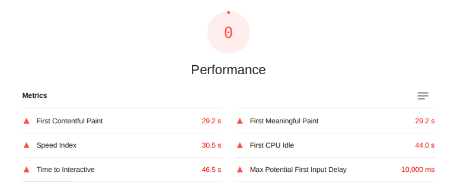
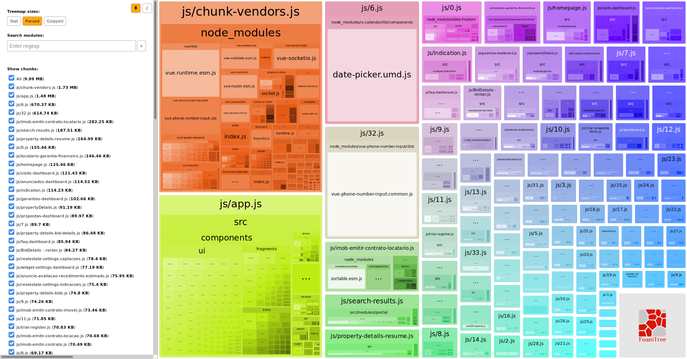

O texto aqui apresentado é uma extensão e tradução [deste artigo](https://www.marianapicolo.com/en/blog/my-notes-about-conducting-a-massive-refactor-in-a-vue-js-website/), escrito pela autora do presente trabalho, em outubro de 2020.

## Introdução

O artigo, originalmente escrito em inglês, tinha como objetivo documentar a trajetória de uma refatoração conduzida com foco na diminuição dos tempos de carregamento de uma aplicação escrita em _Vue.js_.

## Diagnóstico

A aplicação, que nasceu como um MVP (Minimum Viable Project) em 2018, cresceu muito rapidamente à medida que novos clientes contratavam o serviço, e consequentemente novos requisitos eram mapeados. Após algum tempo trabalhando no código, era perceptível certa lentidão no momento em que as páginas carregavam, em torno de 15 a 20 segundos.

Após conduzir testes simples no Lighthouse, foi possível perceber em números: a aplicação deveria ser otimizada para diminuir o tempo de renderização. Algumas das razões para isso poderiam ser: muito código duplicado, bibliotecas não utilizadas, componentes não utilizados, arquivos de imagem não utilizados ou muito pesados, código antigo que não estava sendo removido e assim por diante.

### Tamanho do JavaScript

O tamanho da _build_ da aplicação atingia 30 MB, onde maior parte dele era constituído de bibliotecas instaladas pelos desenvolvedores para facilitar o desenvolvimento, como manipular datas, validar dados de _inputs_ e exibição de _tooltips_. Abaixo estão listadas bibliotecas com os maiores tamanhos:

- [Moment.js](https://momentjs.com/), biblioteca para manipulação de datas, estava ocupando cerca de 2 MB de espaço;
- [Lodash](https://lodash.com/), biblioteca de utilitários, estava ocupando 1,35 MB de espaço;
- [Vee-validate](https://vee-validate.logaretm.com/v4/), biblioteca de validação de formulários, estava ocupando 860 KB de espaço;
- [v-tooltip](https://github.com/Akryum/v-tooltip), biblioteca de tooltips e popovers, tinha cerca de 600 KB, e
- [vue-toastr-2](https://www.npmjs.com/package/vue-toastr-2), biblioteca que permite exibir balões de notificação, possui o jQuery e toastr como dependências, estava ocupando cerca de 450 KB;

## Mudanças na aplicação

Com um diagnóstico mais detalhado, foi possível traçar um plano para refatorar a aplicação. Começando pelas bibliotecas, as que tinham os maiores tamanhos, foram ou substituídas por alternativas menores ou implementadas nativamente na aplicação, diminuindo o tamanho do _bundle_ enviado ao navegador.

### Tree-shaking

Ao longo de toda a aplicação, era possível encontrar imports de toda a biblioteca _lodash_ como:

> `import _ from 'lodash'`

Mudando os imports para utilizar apenas as funções isoladas, como por exemplo:

> `import sortBy from 'lodash/sortBy'`

foi possível notar redução de seu tamanho no _bundle_ para cerca de 200 KB.

### Remoção e substituição de bibliotecas

A biblioteca [Moment.js](https://momentjs.com/) foi removida da aplicação, para dar lugar à Date-fns, passando a ocupar 140 KB na _build_.

A biblioteca [v-tooltip](https://github.com/Akryum/v-tooltip), foi removida da aplicação, porque ela estava sendo usada apenas uma única vez.

A biblioteca [vue-toastr-2](https://www.npmjs.com/package/vue-toastr-2) foi substituída pela biblioteca [vue-notification](http://vue-notification.yev.io/), pois esta possuía um tamanho menor, passando a ocupar 12 KB.

### Lazy loading

Para reduzir os tempos de carregamento, foi aplicado code splitting a nível de rotas da aplicação. Isso faz com que o navegador baixe os apenas os arquivos necessário spara construir uma rota ou página específica quando esta for solicitada pelo usuário. 

Em Vue.js, uma rota que possua code splitting configurado gera um _chunk_ (ou pedaço) diferente que é enviado ao navegador, não sendo mais necessário enviar o _bundle_ inteiro da aplicação, que antes da refatoração, após parseado, atingia quase 30 MB. 

### Imagens em formato WebP

Os arquivos de imagem contidos na aplicação, em sua maioria, estavam em formato `.png`, alguns atingiam até 3 MB de tamanho. Os arquivos foram convertidos para Webp, e passaram ocupar cerca de 200 KB cada, sem perda de qualidade.

## Resultados

Finalizado todo o processo de refatoração, o tamanho da _build_ da aplicação caiu para menos de 10 MB. Também foi perceptível a diminuição do tempo de carregamento das páginas, saindo de 15 a 20 segundos em média, para no máximo 10 segundos ou menos.

