# Introdução

Após conhecer e entender como a experiência do usuário na _web_ é percebida através de dados e como interpretá-los, esta seção apresenta as ferramentas que podem ajudar desenvolvedores a colher métricas de suas aplicações.

## Lighthouse

O Lighthouse é uma ferramenta automatizada de código aberto que analisa páginas da _web_, coletando métricas de desempenho. O Lighthouse executa testes na página desejada, e gera um relatório acerca do desempenho da página. Além disso, apresenta uma série de boas práticas que podem ajudar a melhorar a experiência de desenvolvimento e de usuário. [1]

> O Lighthouse pode ser utilizado através do Chrome DevTools, ou através de uma [extensão](https://chrome.google.com/webstore/detail/lighthouse/blipmdconlkpinefehnmjammfjpmpbjk) para o mesmo navegador.

### Utilizando o Lighthouse pelo Chrome DevTools

- Acesse a página que gostaria de auditar, exemplo: https://github.com/GoogleChrome/lighthouse;

- Abra o developer tools utilizando o atalho _ctrl_ + _Shift_ + i;

- Clique na aba ”lighthouse” no topo do painel que se abriu;

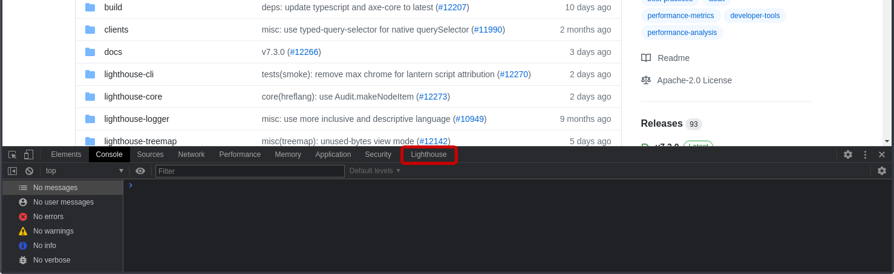

- O Lighthouse será aberto e exibirá as opções disponíveis para customizar os testes;

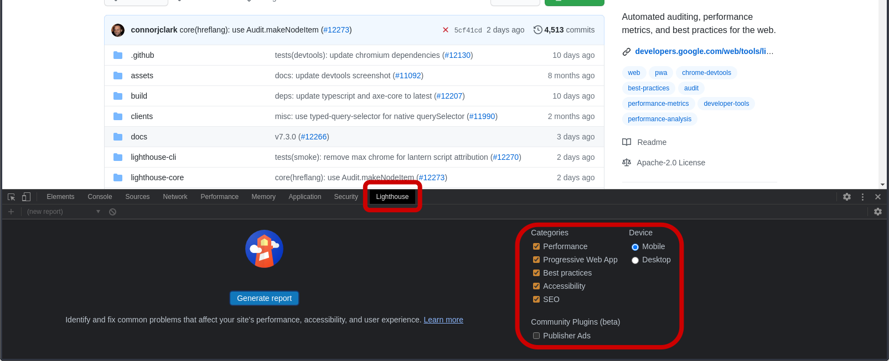

- Clique em “generate report”, e aguarde o lighthouse executar os testes. Após finalizados, a tela com as pontuações das categorias será exibida, como mostrado abaixo:

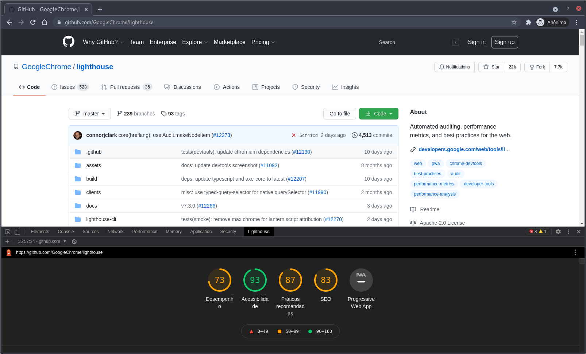

- É possível acessar com mais detalhes o relatório de alguma categoria clicando em sua pontuação. Por exemplo, clicando na categoria "desempenho", serão exibidos os pontos de cada métrica, além sugestões de algumas práticas para melhorar o carregamento da página auditada.

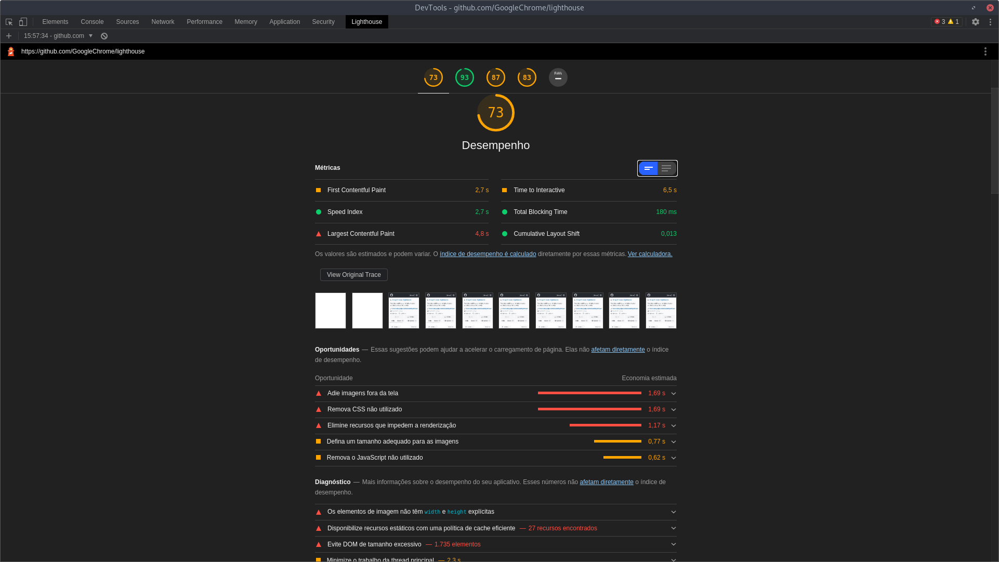

### Utilizando o Lighthouse através da extensão para o Google Chrome

> [Instale a extensão do lighthouse no chrome](https://chrome.google.com/webstore/detail/lighthouse/blipmdconlkpinefehnmjammfjpmpbjk);

- Acesse a página que gostaria de auditar, exemplo: https://github.com/GoogleChrome/lighthouse;

- Abra a extensão localizada no canto superior direito de seu navegador (é representada por um pequeno quadrado verde). Assim que for aberta, exibirá os resultados de desempenho da página.

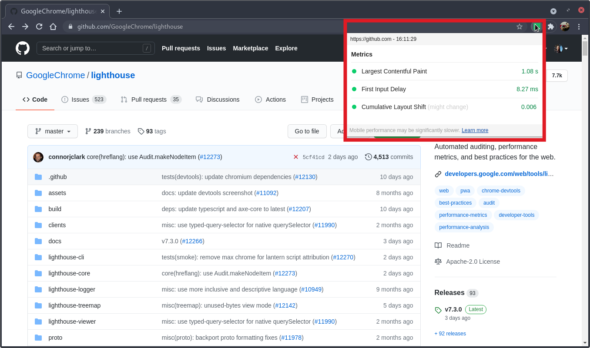

## WebPageTest

O [WebPageTest](https://www.webpagetest.org/) é uma ferramenta que mede e analisa desempenho de páginas _web_. Pode ser acessado através [deste link](https://www.webpagetest.org/). [2]

### Executando um teste simples

- Acesse o WebPageTest e selecione a opção "_Simple Testing_";

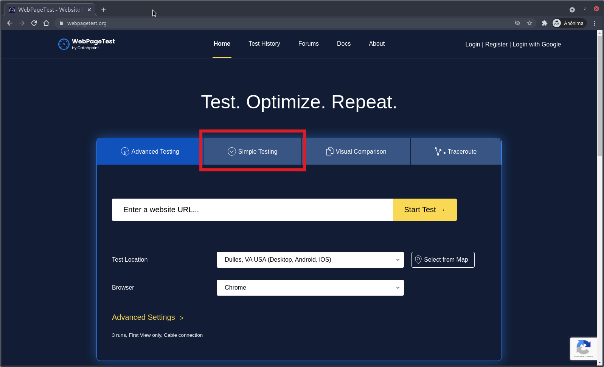

- Insira o endereço que deseja executar os testes. Note que é possível customizar o tipo de dispositivo em que o teste será executado, como celulares com conexão 3G ou 4G, e computadores;

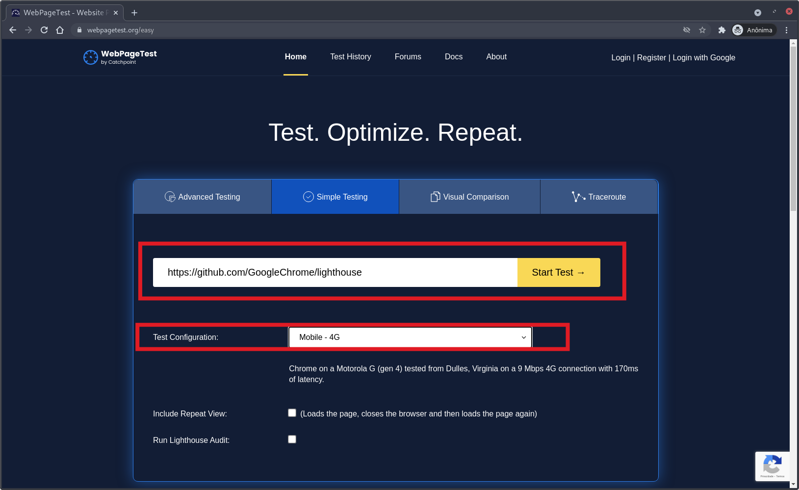

- Aguarde a execução dos testes. A página será automaticamente atualizada após o término dos mesmos e exibirá as pontuações de acordo uma série de categorias como segurança, mecanismo de compressão, compressão de imagens, e tempo de resposta do servidor;

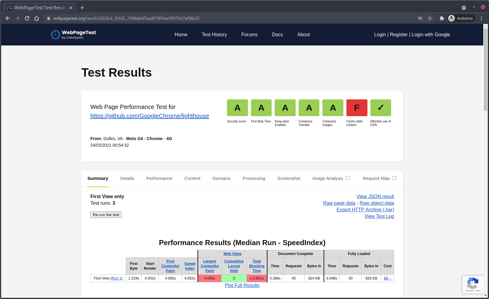

- Para acessar os resultados de cada categoria em detalhes, basta clicar em uma das abas mostradas abaixo do resumo com as notas da página.

## Yellow Lab Tools

[Yellow Lab Tools](https://yellowlab.tools/) é um projeto de código aberto que testa uma página _web_ e detecta problemas de desempenho e de qualidade de código do front-end. Assim como as ferramentas anteriores, permite customizar os testes de acordo com diferentes tipos de dispositivos. [3]

### Realizando um teste

- Acesse a página da [Yellow Lab Tools](https://yellowlab.tools/) e insira a URL da página que deseja auditar, exemplo: https://github.com/GoogleChrome/lighthouse. Caso deseje testar em um dispositivo diferente, também selecione o tipo abaixo da URL inserida. Por fim, inicie o teste clicando em "_Launch test_".

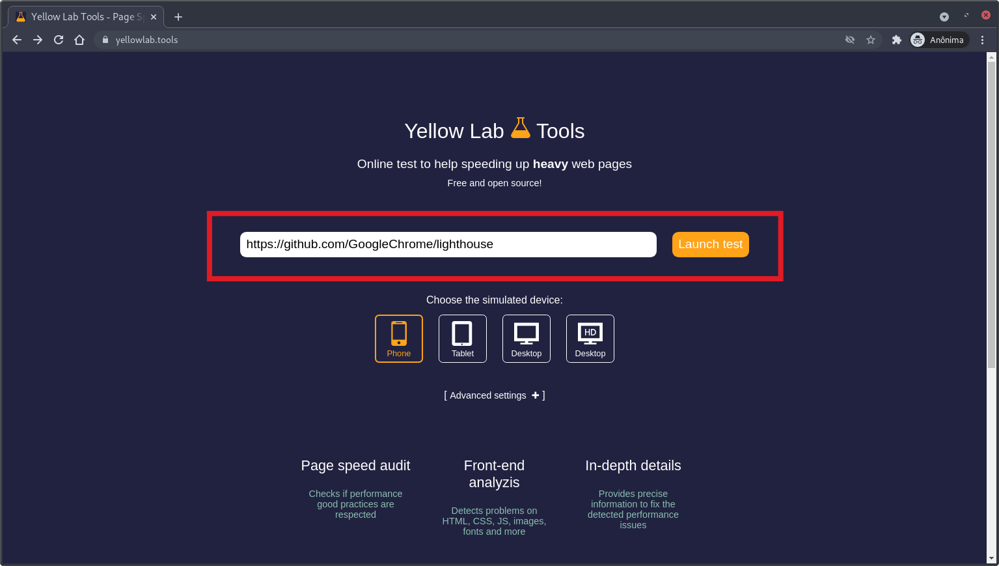

- Aguarde a execução dos testes. A página será atualizada automaticamente com os resultados após o término;

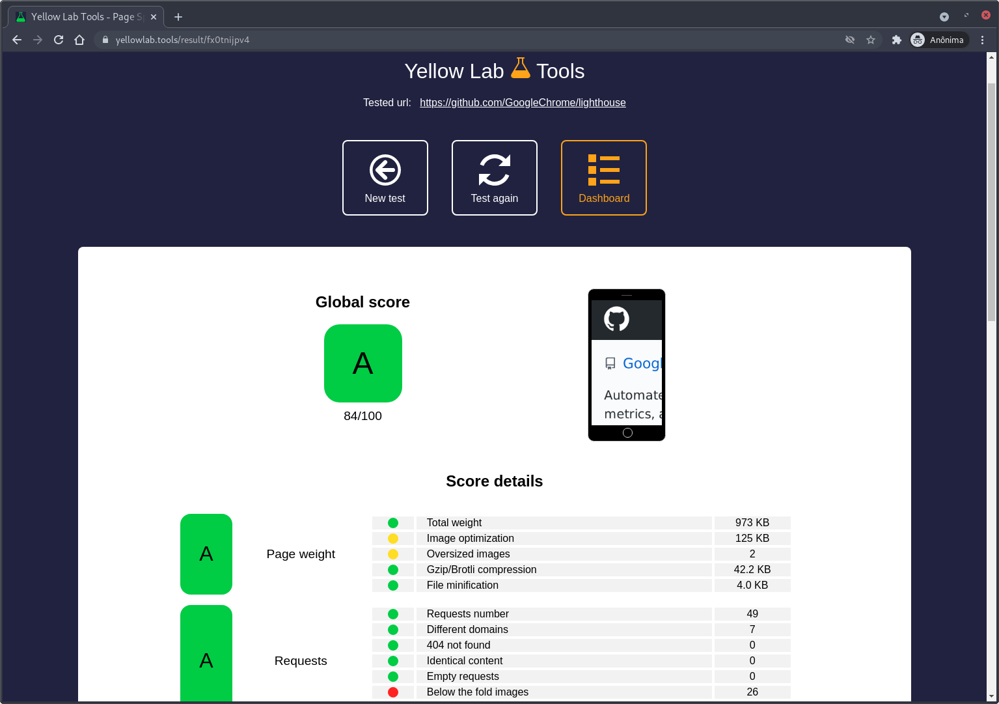

- É possível acessar em detalhes o resultado de qualquer um dos testes clicando em um dos itens da lista. Por exemplo para exibir o tamanho total da página:

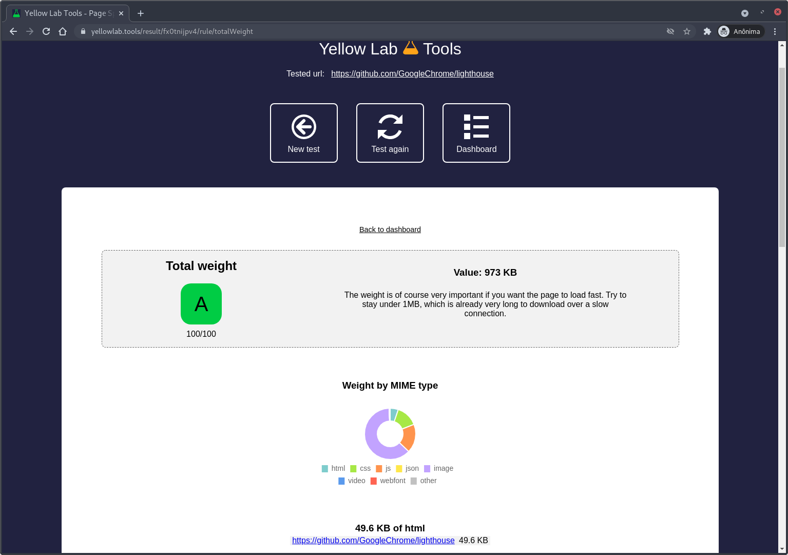

## Monitorando o tamanho da sua aplicação

Existem algumas ferramentas que podem auxiliar a monitorar o tamanho da aplicação, facilitando o diagnóstico das partes que mais entregam arquivos Javascript, por exemplo. 

Ferramentas como [Webpack Bundle Analyzer](https://github.com/webpack-contrib/webpack-bundle-analyzer), [Rollup Plugin Visualizer](https://github.com/btd/rollup-plugin-visualizer) e [parcel-plugin-bundle-visualiser](https://github.com/gregtillbrook/parcel-plugin-bundle-visualiser) geram um mapa interativo que exibe o tamanho dos arquivos contidos no _bundle_.

> Fonte: [Webpack Bundle Analyzer](https://github.com/webpack-contrib/webpack-bundle-analyzer)

## Auditando CSS

O tamanho dos arquivos de CSS também podem impactar o carregamento de uma página _web_, pois é um recurso que pode bloquear o processo de renderização. [4]
Existem algumas ferramentas capazes de auditar, em específico, o CSS utilizado em uma página _web_. Ferramentas como [CSS Stats](https://cssstats.com) e o DevTools do Google Chrome.

### CSS Stats

CSS Stats é uma ferramenta código aberto que analisa uma página _web_ e encontra todas os aquivos CSS e os combina para análise.

#### Analisando uma página _web_

- Acesse o [CSS Stats](https://cssstats.com) e insira o endereço da página a ser analisada e pressione `enter`;

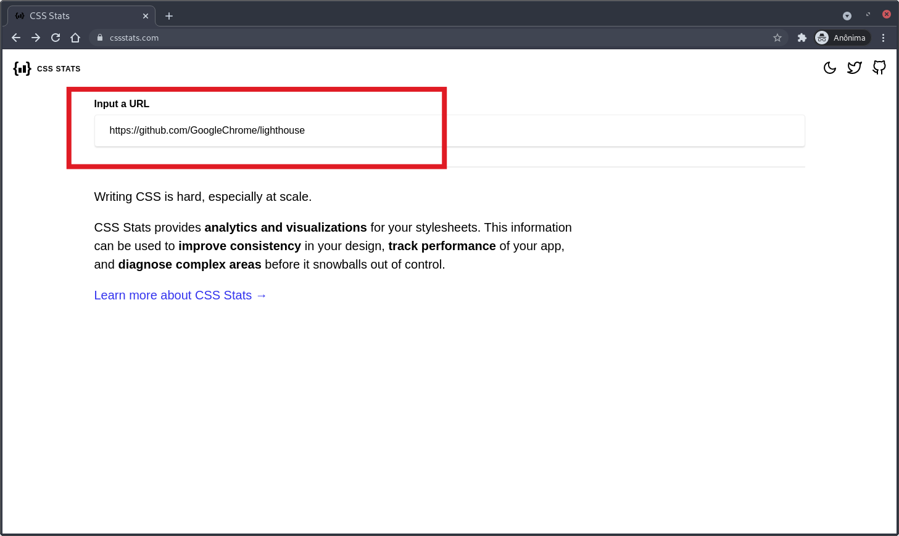

- A página sera analisada e os resultados serão exibidos automaticamente.

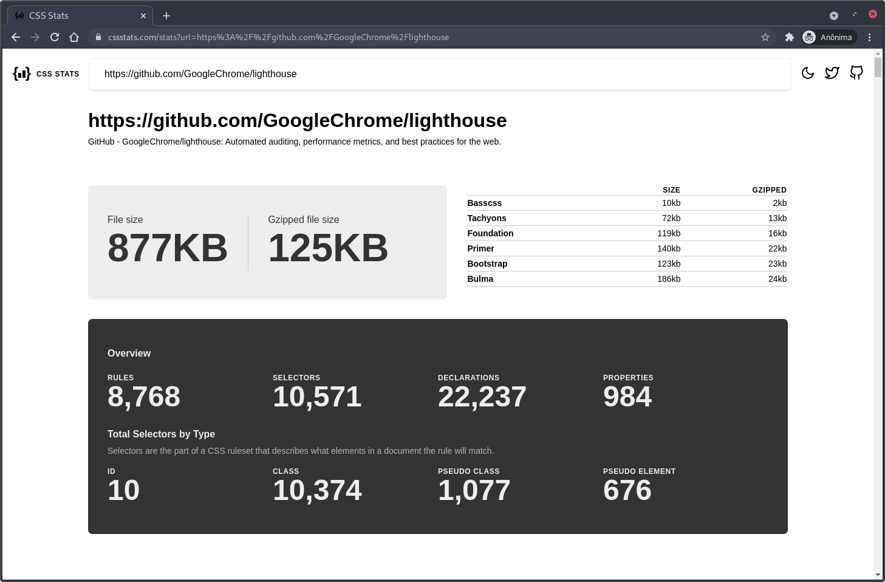

É possivel acessar detalhes como cores, fontes, espaçamentos e definições de layout utilizados em toda a página.

### Chrome DevTools

As ferramentas de desenvolvedor do Google Chrome também apresentam uma seção de análise de CSS. Ajuda a identificar o CSS crítico de uma página e o CSS que não está sendo utilizado. Pode ajudar a refatorar o CSS de uma página visando redução tempos de carregamento.

- Acesse a página que gostaria de auditar, exemplo: https://github.com/GoogleChrome/lighthouse;

- Abra o developer tools utilizando o atalho `Control + Shift + I`;

- Abra o menu de comandos utilizando `Control + Shift + P`;

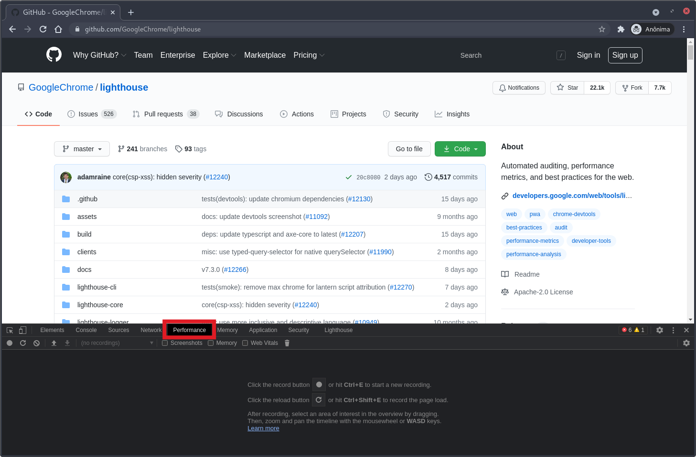

- Busque por "coverage" e pressione `Enter`;

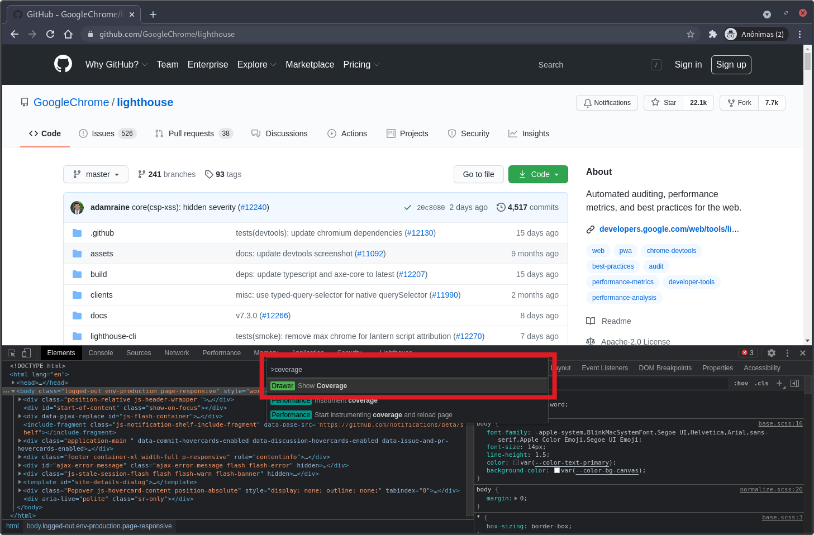

- A aba "coverage" será aberta no drawer;

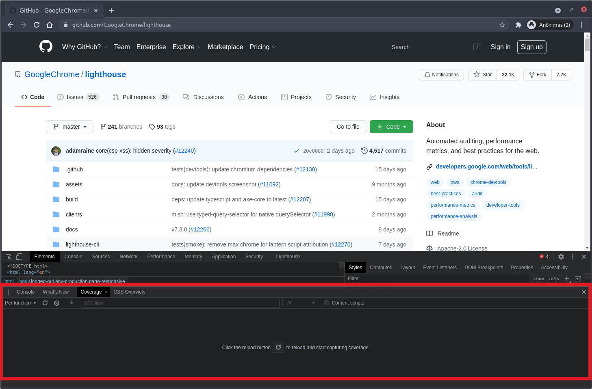

- Clique no botão mostrado no centro da aba. Ele irá recarregar a página atual mostrando o código necessário para construí-la. Para acessar os resultados, pare a gravação clicando no botão vermelho circular à esquerda do painel;

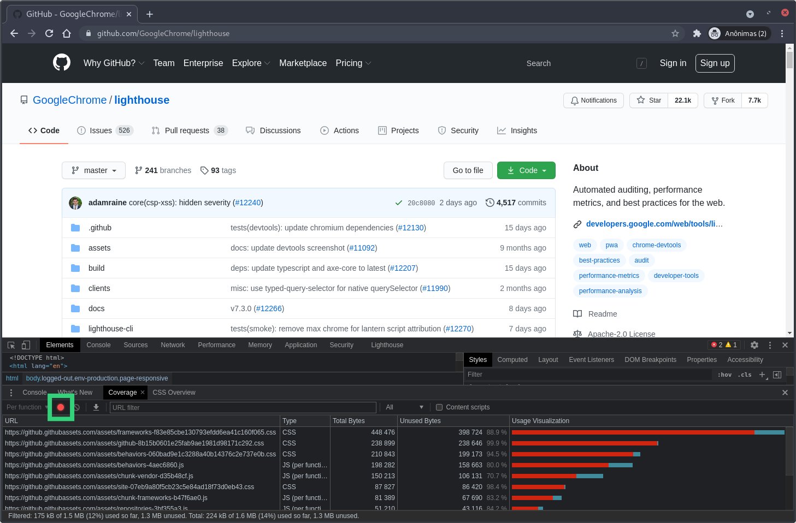

- Os resultados agora podem ser acessados. É possível ver a porcentagem de código não utilizado. Clique em um item da lista para acessar seu respectivo arquivo. Os detalhes serão exibidos na aba "sources", logo acima da drawer. Os trechos de código não utilizados serão exibidos com uma marcação vermelha do lado esquerdo.

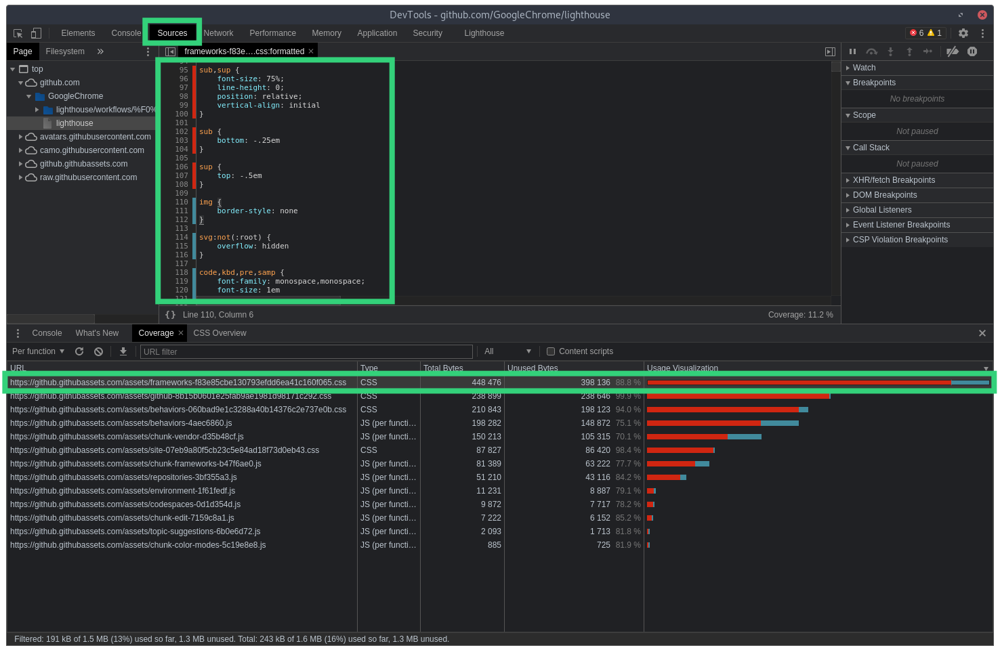

## Referências

- (1) [Google Developers: Lighthouse](https://developers.google.com/web/tools/lighthouse);
- (2) [Catchpoint: WebPageTest](https://www.webpagetest.org/);
- (3) [Yellow Labs Tools](https://yellowlab.tools/);
- (4) [Milica Mihajlija: Extract critical CSS](https://web.dev/extract-critical-css/);
- (5) [CSS STATS](https://cssstats.com);
